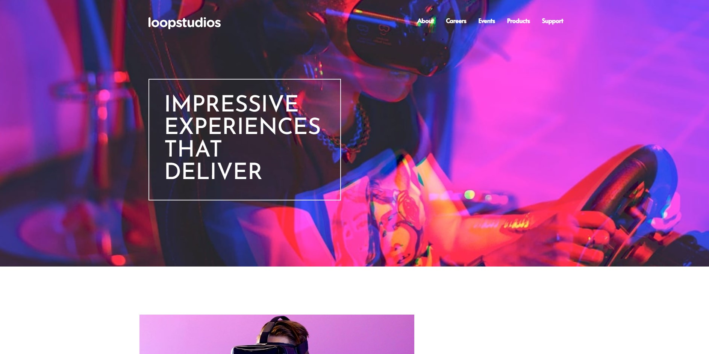
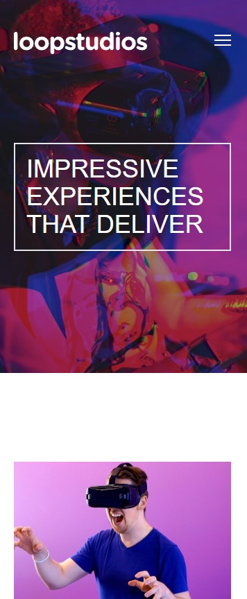

# Frontend Mentor - Loopstudios landing page

This is a solution to the [Loopstudios landing page](https://www.frontendmentor.io/challenges/loopstudios-landing-page-N88J5Onjw). Frontend Mentor challenges help you improve your coding skills by building realistic projects.

## Table of contents

- [Overview](#overview)
  - [The challenge](#the-challenge)
  - [Screenshot](#screenshot)
  - [Links](#links)
- [My process](#my-process)

  - [Built with](#built-with)
  - [What I learned](#what-i-learned)
  - [Continued development](#continued-development)

- [Author](#author)

## Overview

I took on this challenge as a chance to strengthen my skills in Angular and Tailwind. While using a full-featured framework like Angular for a smaller project might seem like overkill, I saw it as a great opportunity to practice and reinforce core concepts. I specifically focused on integrating Angular with Tailwind, and the experience was genuinely enjoyable.

### The challenge

Users should be able to:

The challenge is to build out this landing page and get it looking as close to the design as possible.

users should be able to:

- View the optimal layout for the site depending on their device's screen size
- See hover states for all interactive elements on the page

### Screenshot

### Links

- Solution URL: [Solution](https://github.com/HosseinHeydarpour/loopstudios)
- Live Site URL: [Live(Vercel)](https://loopstudios-two-beige.vercel.app/)

### Built with

- Semantic HTML5 markup
- Tailwind 3
- Flexbox
- Mobile-first workflow
- [Angular](https://angular.dev/) - JS Framework

### What I learned

The core challenge in this project was using angular and tailwind CSS together. Also adding a working hamburger menu in angular way was a nice challenge.

### Continued development

Looking ahead, I plan to do more projects with Tailwind CSS for greater flexibility and modern styling. I'm also aiming to incorporate testing into my workflow and start practicing Test-Driven Development (TDD) to write more reliable and maintainable code.

## Author

- My Linkedin - [Hossein Heydarpour - Linkedin](https://www.linkedin.com/in/hosseinheydarpour)
- Frontend Mentor - [@HosseinHeydarpour](https://www.frontendmentor.io/profile/HosseinHeydarpour)
- My X - [@Htechdaily](https://www.x.com/Htechdaily)
